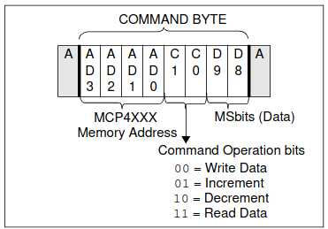
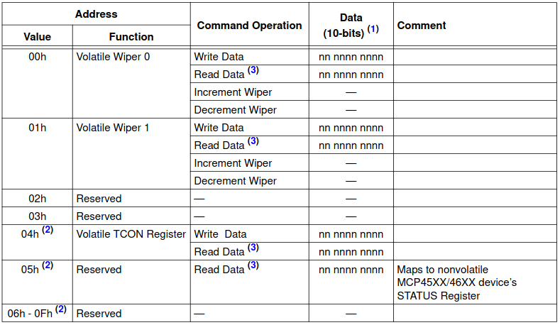
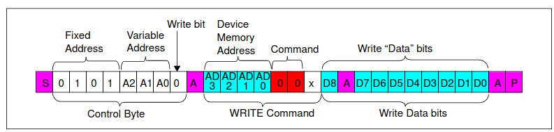
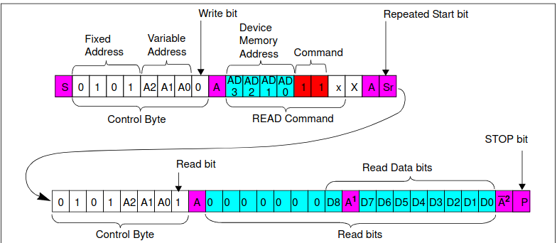

# IO documentation

# How some IC`s work.

1. INA219
2. MCP4531 

# The INA219

The INA219 is a ic that Calculates the current and measures the voltage.

## I2C Address

1. The 7 bit address for the charge current sensor is 0b1000000
2. The 7 bit address for the discharge current sensor is 0b1000001

## The data registers

### The Config Register address 0x00.

| MSB | 14 | 13   | 12  | 11  | 10     | 9      | 8      | 7      | 6      | 5      | 4      | 3      | 2      | 1      | LSB    |
|-----|----|------|-----|-----|--------|--------|--------|--------|--------|--------|--------|--------|--------|--------|--------|
| RST | — | BRNG | PG1 | PG0 | BADC 3 | BADC 2 | BADC 1 | BADC 0 | SADC 3 | SADC 2 | SADC 1 | SADC 0 | MODE 2 | MODE 1 | MODE 0 |
| 0   | 0  | 0    | 1   | 0   | 1      | 0      | 0      | 0      | 1      | 0      | 0      | 0      | 1      | 1      | 1      |
| 0   | 0  | 0    | 1   | 0   | 1      | 1      | 0      | 1      | 1      | 1      | 0      | 1      | 1      | 1      | 1      |

We have 2 different values. The first makes only one sample and saves it in the register. The second makes 128 monsters and calculates the average and saves it in the register.

More info see the data sheet.

The values in Hex are 0x1447 or 0x16EF

***

### The Shunt voltage register address 0x01.

| MSB  | 14   | 13     | 12     | 11     | 10     | 9     | 8     | 7     | 6     | 5     | 4     | 3     | 2     | 1     | LSB   |
|------|------|--------|--------|--------|--------|-------|-------|-------|-------|-------|-------|-------|-------|-------|-------|
| SIGN | SIGN | SD13_4 | SD12_4 | SD11_4 | SD10_4 | SD9_4 | SD8_4 | SD7_4 | SD6_4 | SD5_4 | SD4_4 | SD3_4 | SD2_4 | SD1_4 | SD0_4 |

The 2 MSB are the sign. The 14 following bits are the voltage in decimal. To get the real value you need to divide by 100 to get the voltage in mV.

***

### The V-bus register address 0x02.

| MSB  | 14   | 13   | 12  | 11  | 10  | 9   | 8   | 7   | 6   | 5   | 4   | 3   | 2 | 1    | LSB |
|------|------|------|-----|-----|-----|-----|-----|-----|-----|-----|-----|-----|---|------|-----|
| BD12 | BD11 | BD10 | BD9 | BD8 | BD7 | BD6 | BD5 | BD4 | BD3 | BD2 | BD1 | BD0 | — | CNVR | OVF |

The 13 MSB are the voltage value to get the real voltage you need to multiply it with 4mV.

***

### The Power Register address 0x03.

We wont use this one.

***

### The Current Register address 0x04.

| MSB   | 14   | 13   | 12   | 11   | 10   | 9   | 8   | 7   | 6   | 5   | 4   | 3   | 2   | 1   | LSB |
|-------|------|------|------|------|------|-----|-----|-----|-----|-----|-----|-----|-----|-----|-----|
| CSIGN | CD14 | CD13 | CD12 | CD11 | CD10 | CD9 | CD8 | CD7 | CD6 | CD5 | CD4 | CD3 | CD2 | CD1 | CD0 |

To get the real value you need to multiply by $I_{LSB} =  \tfrac{I_{max}}{2^{15}}$.

In our case is $I_{max}$ 10A so the LSB is $305\mu A$.

***

### The Calibration Register address 0x05.

| MSB  | 14   | 13   | 12   | 11   | 10   | 9   | 8   | 7   | 6   | 5   | 4   | 3   | 2   | 1   | LSB |
|------|------|------|------|------|------|-----|-----|-----|-----|-----|-----|-----|-----|-----|-----|
| FS15 | FS14 | FS13 | FS12 | FS11 | FS10 | FS9 | FS8 | FS7 | FS6 | FS5 | FS4 | FS3 | FS2 | FS1 | FS0 |

To calculate the Calibration Value you need this equation: 

$ Cal = trunc \left( \tfrac{0.04096}{I_{LSB}  * R_{SHUNT}} \right) $

In our case using 2 shunt resistor in parallel and resistent of  $0.01\Omega$ each is the value 0x68DB.

***

# MCP4531

## I2C Address

1. The 7 bit address for the digital potentiometer is 0b0101110

## The data registers

### Wiper 0 0x00

write 10 bits of data MSB wil be ignored only 9 will be saved.

read 2 Bytes and only the last 10 bits have data.

### some screenshots.

