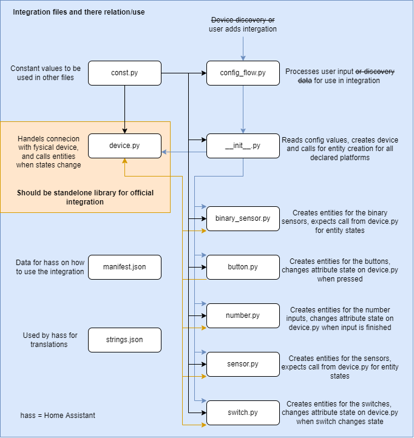

# Development

## List of contents

1. [Installation](#1-installation)
    1. [Setup Development Environment](#11-setup-development-environment)
    2. [Add the custom component to Home Assistant](#12-add-the-custom-component-to-home-assistant)
        1. [Add the component to the custom_components folder](#121-add-the-component-to-the-custom_components-folder)
        2. [Add the component to the components folder](#122-add-the-component-to-the-components-folder)
2. [Usage](#2-usage)
3. [Testing](#3-testing)
4. [The lvups component](#4-the-lvups-component)
    1. [Device information](#41-device-information)
    2. [File structure and relations](#42-file-structure-and-relations)

## 1. Installation

### 1.1 Setup Development Environment

Before we can start developing, we need our development environment to be set up.  
To do this follow the steps provided by the Home Assistant developer documentation, which can be found [here](https://developers.home-assistant.io/docs/development_environment/).

Once the development environment is set up, we can add our custom component to Home Assistant.

**Note:**  
Don't forget to run the `Install all requirements` task in Visual Studio Code, this will install all the required dependencies for Home Assistant.

### 1.2 Add the custom component to Home Assistant

**There are two ways to do this:**

- Add the component to the custom_components folder (drag and drop, easier for testing)
- Add the component to the components folder (some extra steps, easier for development)

**So what's the difference between these two methods?**  

Both methods will add the component to your Home Assistant installation, but there are some differences.

When you add the component to the custom_components folder, Home Assistant will try to load the component from this folder and expect it to work.
If you have a component that just needs some testing, this is the easiest way to do it.  
The config folder is not part of the Home Assistant repository, because it contains all the user specific configurations.  
This means that if you add your component to this folder, any changes you make to the component will not be tracked by git.

When you add the component to the components folder, Home Assistant will handle the component as a built-in component.
If you're developing a component that you want to add to Home Assistant, this is the way to go.
This gives you the benefits of the Home Assistant development tools, like translation, unit tests, etc.
But also means that your code needs to follow the Home Assistant Rules and Guidelines before you can commit it to your fork.

#### 1.2.1 Add the component to the custom_components folder

1. Got to the config folder of your Home Assistant installation and create a new folder called `custom_components` (if it doesn't exist already).
2. In this folder just drag and drop the content of the `component` folder from this repository.

That's it, the component is now added to your Home Assistant installation.

#### 1.2.2 Add the component to the components folder

1. Open a terminal in the root of your Home Assistant installation.
2. Run the following command: `python3 -m script.scaffold integration`. (This script will create a new component in the components folder.)
3. Fill in the following information when prompted (for this component):
    - What is the domain?
        > `lvups`

    - What is the name of your integration?
        > `Low Voltage UPS`

    - What is your GitHub handle?
        > `??` (your GitHub username, @username)

    - What PyPI package and version do you depend on? Leave blank for none.
        > (We are not using any dependencies, so leave this blank)

    - How will your integration gather data?
        > `local_push` (We update the state when the device pushes an update, so we don't need to poll the device)

    - Does Home Assistant need the user to authenticate to control the device/service? (yes/no) [yes]
        > `no` (We don't need to authenticate to control the device)

    - Is the device/service discoverable on the local network? (yes/no) [no]
        > `no` (The device is not discoverable on the local network)

    - Is this a helper integration? (yes/no) [no]
        > `no` (This is not a helper integration)

    - Can the user authenticate the device using OAuth2? (yes/no) [no]
        > `no` (We are using mqtt, so we don't need OAuth2)

4. Wait for the script to finish. (Home Assistant will create all the necessary files for you)
5. Open the folder `homeassistant/components/lvups` in your favorite editor.
6. Replace the contents of the folder with the contents of the `component` folder from this repository.

That's it, the component is now added to your Home Assistant installation.

## 2. Usage

Now that the component is added to your Home Assistant installation, you can start using/developing it.  
More information about developing custom components can be found [here](https://developers.home-assistant.io/docs/creating_component_index).

## 3. Testing

When you want to test the code, you can spin up a Home Assistant instance with the custom component installed.  
If your using Visual Studio Code, you can simply press `F5` to start a Home Assistant instance.

**Note:**  
When this is the first time you are starting Home Assistant, it will require you to do the initial setup, just like a normal Home Assistant installation.  
This means that you will need to create a user, set a password, etc.

## 4. The lvups component

### 4.1 Device information

The lvups device has the following attributes:

controls:

- `Charge battery`: A switch that can be used to tell the device it should charge the battery. (default: `off`)
- `Use battery`: A switch that can be used to tell the device it should use the battery, when recieving grid power. (default: `off`)

sensors:

- `Battery percentage`: A sensor that shows the current battery percentage.
- `Charge time`: A sensor that shows the time left until the battery is fully charged, estimate. (When charging)
- `Discharge time`: A sensor that shows the time left until the battery is fully discharged, estimate. (When discharging)
- `Discharge time max load`: A sensor that shows the time left until the battery is fully discharged, estimate on max load. (Always shown)
- `Charging battery`: A sensor that shows if the battery is currently charging.
- `Using battery`: A sensor that shows if the battery is currently being used.
- `Recieving power`: A sensor that shows if the device is currently recieving power from the grid.

Configuration:

- `Battery size`: The capacity of the battery in mAh. (default: `0`)
- `Max charge`: The maximum percentage the battery can be charged to. (default: `100`)
- `Min charge`: The minimum percentage the battery can be discharged to. (default: `0`)
- `Restart`: A button that can be used to restart the device.

Diagnostic:

- `Uptime`: The time the device has been running, in `hours:minutes:seconds` format.

### 4.2 File structure and relations

### 4.2 Todo

- [ ] Add mqtt discovery
- [ ] Add LWT (last will and testament)
- [ ] Add unit tests (for device and config flow)
- [ ] Change translations (on/off -> charging/discharging, etc.)
- [ ] Add more sensors, switches, etc. (depends on the hardware)
- [ ] Move device code to a library (as needed by the Home Assistant Rules and Guidelines)
- [ ] Make the code comply with the Home Assistant Rules and Guidelines (so it may someday be added to Home Assistant)
