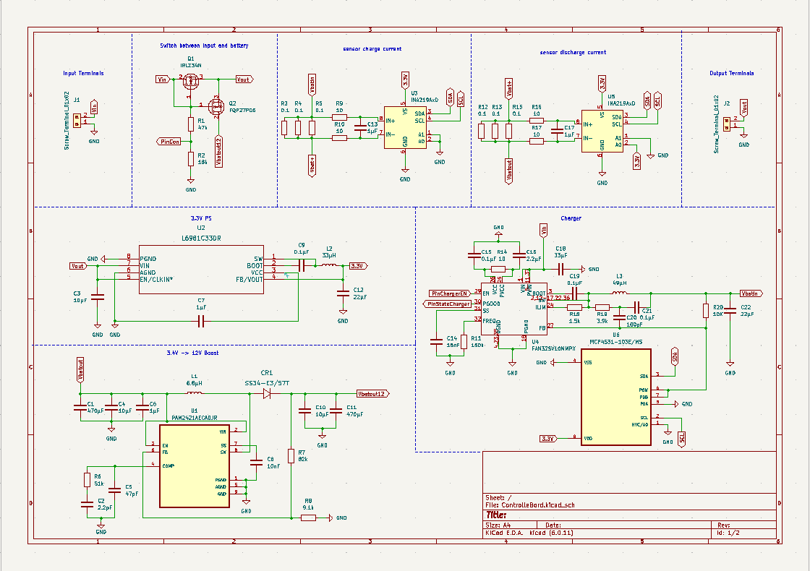
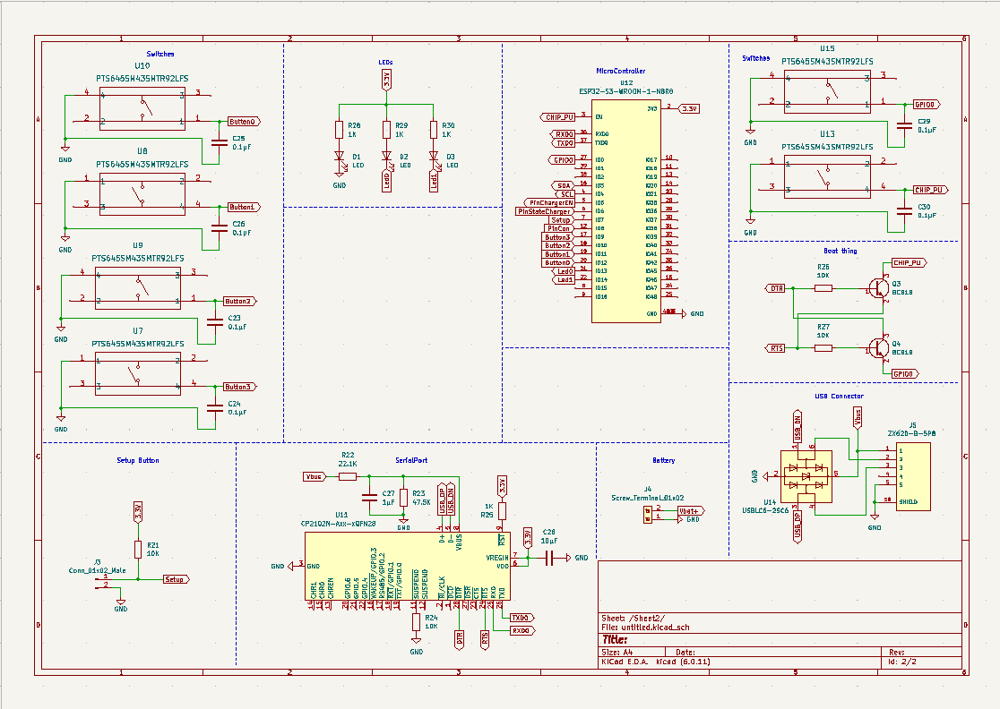
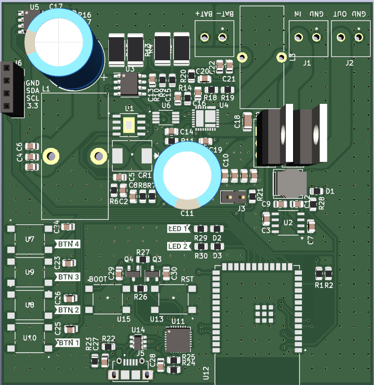
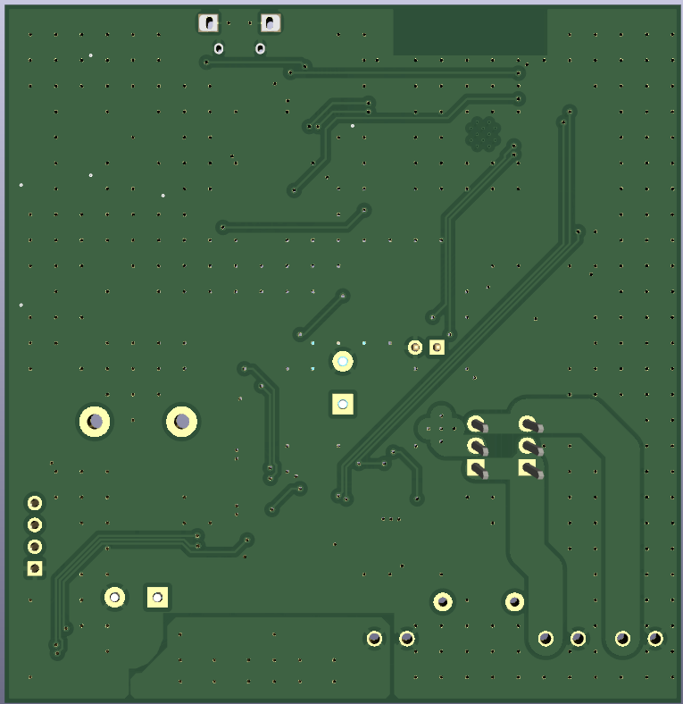

# Circuit Board

## To do

1. vermogen verbruik van de aangesloten toestel.
2. gaten in de pcb maken.
3. kiezen tussen de batterij en net.
4. soon^tm

## Schematic

## PCB

| Front | Back |
|---|---|
|  |  |

## BOM

The BOM or Bill of Materials consists out of a list of all the components with some of theire properties. 

| Designator | Quantity | Description | Footprint | Farnell ordercode | Price / unit |
|---|---|---|---|---|---|
| R25, R28-R30 | 4 | 1 kΩ | 0805 | [2073606](https://be.farnell.com/multicomp/mcmr08x1001ftl/res-1k-1-0-125w-0805-ceramic/dp/2073606) | 0,0165 € |
| R19 | 1 | 47.5 kΩ | 0805 | [2447665](https://be.farnell.com/multicomp/mcwr08x4752ftl/res-47k5-1-0-125w-thick-film/dp/2447665) | 0,0077 € |
| R18 | 1 | 22.1 kΩ | 0805 | [3496003](https://be.farnell.com/yageo/rc0805fr-0722k1l/res-22k1-1-0-125w-0805-thick-film/dp/3496003) | 0,029 € |
| R16, R17, R20, R22, R23 | 5 | 10 kΩ | 0805 | [1612522](https://be.farnell.com/bourns/cr0805-fx-1002elf/res-10k-1-0-125w-0805-thick-film/dp/1612522) | 0,029 € |
| R15 | 1 | 3.9 kΩ | 0805 | [2447654](https://be.farnell.com/multicomp/mcwr08x3901ftl/res-3k9-1-0-125w-thick-film/dp/2447654) | 0,0078 € |
| R14 | 1 | 1.5 kΩ | 0805 | [9333924](https://be.farnell.com/multicomp/mc01w080551k5/res-1k5-5-0-1w-0805-thick-film/dp/9333924) | 0,0153 € |
| R9 | 1 | 150 kΩ | 0805 | [2447573](https://be.farnell.com/multicomp/mcwr08x1503ftl/res-150k-1-0-125w-thick-film/dp/2447573) | 0,0078 € |
| R7, R8, R11-R13 | 5 | 10 Ω | 0805 | [2331768](https://be.farnell.com/te-connectivity/crgh0805j10r/res-10r-5-0-33w-0805-thick-film/dp/2331768) | 0,0132 € |
| R3-R5, R12, R13, R15 | 6 | 0.1 Ω | 0805 | [3994646](https://be.farnell.com/walsin/ww08xr100ftl/res-r100-0-125w-0805-thick-film/dp/3994646?st=shunt%20resistor) | 0,0302 € |
| R5 | 1 | 9.1 kΩ | 0805 | [2447739](https://be.farnell.com/multicomp/mcwr08x9101ftl/res-9k1-1-0-125w-thick-film/dp/2447739) | 0,0078 € |
| R4 | 1 | 82 kΩ | 0805 | [9237860](https://be.farnell.com/yageo/rc0805fr-0782kl/res-82k-1-0-125w-0805-thick-film/dp/9237860) | 0,029 € |
| R3 | 1 | 18 kΩ | 0805 | [2447584](https://be.farnell.com/multicomp/mcwr08x1802ftl/res-18k-1-0-125w-thick-film/dp/2447584) | 0,0078 € |
| R2 | 1 | 47 kΩ | 0805 | [9237836](https://be.farnell.com/yageo/rc0805fr-0747kl/res-47k-1-0-125w-0805-thick-film/dp/9237836) | 0,042 € |
| R1 | 1 | 51 kΩ | 0805 | [2447680](https://be.farnell.com/multicomp/mcwr08x5102ftl/res-51k-1-0-125w-0805-thick-film/dp/2447680) | 0,0081 € |
|---|---|---|---|---|---|
| C2 | 1 | 2.2 pF | 0805 | [3764575](https://be.farnell.com/yageo/cc0805crnpo9bn2r2/cap-2-2pf-50v-mlcc-0805/dp/3764575) | 0,0456 € |
| C5 | 1 | 47 pF | 0805 | [2812152](https://be.farnell.com/wurth-elektronik/885012007032/cap-47pf-25v-5-c0g-np0-0805/dp/2812152) | 0,047 € |
| C6, C7, C13, C17, C23 | 5 | 1μF | 0805 | [3873501](https://be.farnell.com/yageo/cc0805kkx6s8bb105/cap-1uf-25v-mlcc-0805/dp/3873501) | 0,0375 € |
| C8 | 1 | 10 nF | 0805 | [2534062](https://be.farnell.com/wurth-elektronik/885012207066/cap-0-01-f-25v-10-x7r-0805/dp/2534062) | 0,037 € |
| C3, C4, C10, C24 | 4 | 10 μF | 0805 | [3013452](https://be.farnell.com/samsung-electro-mechanics/cl21a106kaynnne/cap-10uf-25v-mlcc-0805/dp/3013452) | 0,073 € |
| C1, C11 | 1 | 470 μF | Radial Leaded | [9451439](https://be.farnell.com/multicomp/mcgpr50v477m13x21/cap-470-f-50v-20/dp/9451439) | 0,546 € |
| C12, C22 | 2 | 22 μF | 0805 | [1907510](https://be.farnell.com/murata/grm21br61e226me44l/cap-22-f-25v-20-x5r-0805/dp/1907510) | 0,178 € |
| C14 | 1 | 15 nF | 0805 | [2812419](https://be.farnell.com/wurth-elektronik/885012207067/cap-0-015-f-25v-10-x7r-0805/dp/2812419) | 0,0344 € |
| C9, C15, C19, C21, C23-C26, C29, C30 | 10 | 0.1 μF | 0805 | [2522443](https://be.farnell.com/kemet/c0805c104z3vactu/cap-0-1-f-25v-y5v-0805/dp/2522443) | 0,033 € |
| C16 | 1 | 2.2 μF | 0805 | [2073606](https://be.farnell.com/samsung-electro-mechanics/cl21a225kafnnne/cap-2-2uf-25v-mlcc-0805/dp/3013458) | 0,049 € |
| C18 | 1 | 33 μF | 1206 | [2525171](https://be.farnell.com/tdk/c3216x5r1e336m160ac/cap-33-f-25v-20-x5r-1206/dp/2525171) | 0,826 € |
| C20 | 1 | 100 pF | 0805 | [2812409](https://be.farnell.com/wurth-elektronik/885012207054/cap-100pf-25v-10-x7r-0805/dp/2812409) | 0,0468 € |
|---|---|---|---|---|---|
| J1, J2, J4 | 3 | 2 ways | screw terminal | [3810178](https://be.farnell.com/amphenol-anytek/yo0221500000g/tb-wire-to-brd-r-a-2way-16awg/dp/3810178) | 0,455 € |
|---|---|---|---|---|---|
| U7-U10, U13, U15 | 6 | Switch | Switch | [2320087](https://be.farnell.com/c-k-components/pts645sm43smtr92lfs/switch-spst-0-05a-12vdc-smd-4/dp/2320087) | 0,25 € |
|---|---|---|---|---|---|
| J5 | 1 | USB connector | USB | [2554980](https://be.farnell.com/hirose-hrs/zx62d-b-5p8-30/micro-usb-2-0-type-b-rcpt-smt/dp/2554980?st=zx62d-b-5p8) | 0,846 € |
| U14 | 1 | ESD Protection Device | SOT-23 | [2290332](https://be.farnell.com/kingbright/kp-2012seck/led-0805-250mcd-orange/dp/2290332) | 0,159 € |
|---|---|---|---|---|---|
| SR1 | 1 | diode | DO-214 | [2101195](https://be.farnell.com/multicomp/ss34a/diode-rectifier-3a-40v-do-214ac/dp/2101195?st=ss34) | 0,401 € |
| D1 - D3 | 3 | led | 0805 | [2101195](https://be.farnell.com/multicomp/ss34a/diode-rectifier-3a-40v-do-214ac/dp/2101195?st=ss34) | 0,401 € |
|---|---|---|---|---|---|
| U6 | 1 | I2c potentiometer | MSOP | [8737606](https://be.farnell.com/microchip/mcp4531-103e-ms/dpot-single-7bit-v-i2c-8msop/dp/1698946?st=digital%20potentiometer) |0,40 € |
|---|---|---|---|---|---|
| L1 | 1 | 6.8 μH | YUP | [3518424](https://nl.farnell.com/wurth-elektronik/7447720068/inductor-6-8uh-unshielded-3-9a/dp/3518424) | € 0,756 |
| L2 | 1 | 33 μH | YUP | [2061655](https://nl.farnell.com/bourns/srn6045-330m/inductor-33uh-semi-shielded-power/dp/2061655) | € 0,408 |
| L3 | 1 | 49 μH | YUP | [3517136](https://nl.farnell.com/wurth-elektronik/744132/toroidal-inductor-49uh-5-8a-tht/dp/3517136) | € 2,56 |
|---|---|---|---|---|---|
| U3, U5 | 1 | 10 kΩ | SOIC | [3517136](https://be.farnell.com/texas-instruments/ina219bidr/current-power-monitor-11khz-soic/dp/3118166?st=ina219) | 2,96 € |
|---|---|---|---|---|---|
| U1 | 1 | Buck | SOIC | [3755444](https://be.farnell.com/diodes-inc/pam2421aecadjr/dc-dc-conv-boost-520khz-40-to/dp/3755444?st=pam2421) | 0,90 € |
| U2 | 1 | Buck| SOIC | [4064213](https://be.farnell.com/stmicroelectronics/l6981c33dr/dc-dc-conv-sync-buck-400khz-150deg/dp/4064213?st=l6981c) | 3,02 € |
| U4 | 1 | Buck | QFN-34 | [2355372](https://be.farnell.com/onsemi/fan23sv10mmpx/buck-synch-adj-10a-1-5mhz-34pqfn/dp/2355372?st=fan23sv10m) | 1,72 € |
|---|---|---|---|---|---|
| Q2 | 1 | P-kanaal | TO-220 | [8648620](https://be.farnell.com/infineon/irf9540npbf/mosfet-p-100v-23a-to-220/dp/8648620) | 1,55 € |
| Q1 | 1 | N-kanaal | TO-220 | [2547307](https://be.farnell.com/vishay/irfz34pbf/mosfet-n-ch-60v-30a-to-220ab-3/dp/2547307) | 1,96 € |

Total price: 65,03 €

| Designator | Quantity | Description | Footprint | Mouser ordercode | Price / unit |
|---|---|---|---|---|---|
| U12 | 1 | ESP32-S3 | ESP32 | [C2913202](https://www.lcsc.com/product-detail/WiFi-Modules_Espressif-Systems-ESP32-S3-WROOM-1-N16R8_C2913202.html) | € 4.83 |
| U11 | 1 | CP2102NA02GQFN28 | QFN28 | [C964632](https://www.lcsc.com/product-detail/USB-ICs_SILICON-LABS-CP2102N-A02-GQFN28R_C964632.html) | € 2.60 |

Total price: €10.26
